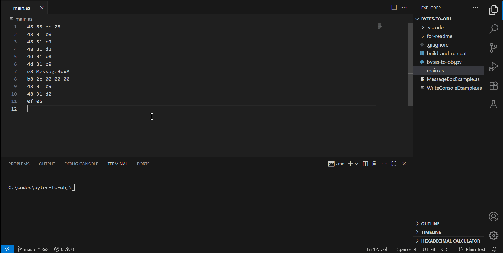

### Скрипт для сборки объектного файла из машинных кодов для Intel x64/Windows

### Что это такое

Данный скрипт bytes-to-obj.py позволяет создать объектный файл вида COFF для
ОС Windows. Этот объектный файл можно слинковать линковщиком и получить исполняемый (.exe).
На вход скрипту bytes-to-obj.py подаётся текстовый файл, в котором записаны машинные коды
семейства Intel x64. Также есть возможность вызывать функции сторонних библиотек,
подписывать комментарии и писать строки текста в двойных кавычках (см. пример 
WriteConsoleExample.as).

### Как запустить пример

1. Скачать интерпретатор Python3 и линковщик golink. 
2. Оба поместить в переменную PATH или в папку с проектом, чтобы скрипт сборки их "видел"
3. Запустить скрипт сборки "build-and-run.bat"

### Как написать свою программу в машинных кодах

- Все машинные коды и способы их построения описаны в руководстве
Intel Software Developer's Manual.
- Машинные коды обязательно пишутся через пробел, по одному байту в шестнадцатеричной кодировке.
Без префикса "0x" или постфикса "h"
- Можно вызывать функции из сторонних библиотек. Для этого после "опкода" инструкции call,
который равен байту 0xE8, нужно написать название вызываемой функции, и слинковать 
полученный объектный файл с нужной библиотекой.
- Можно писать комментарии. За комментарий считается текст от знака решётки '#' до переноса строки.
- Можно писать строки вместо байтов. Такие строки заключены в двойные кавычки. Они становятся
байтами при сборке объектного файла.

### Ограничения скрипта

- Невозможно перезаписать байты в самой программе во время исполнения. Другими словами,
если написать инструкцию, которая перемещает какое-либо число в память программы пока та
исполняется, ничего не произойдёт. Это связано с тем, что весь код программы помещается 
в секцию .text объектного файла. Эта секция имеет доступ на чтение и исполнение, но не 
на запись. Для возможности записи данных нужны секции .data и .bss в объектном файле.
